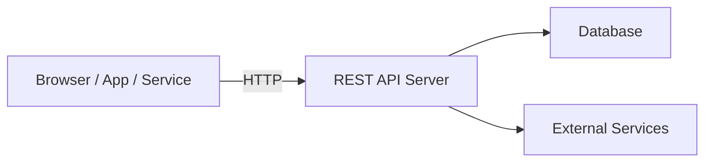
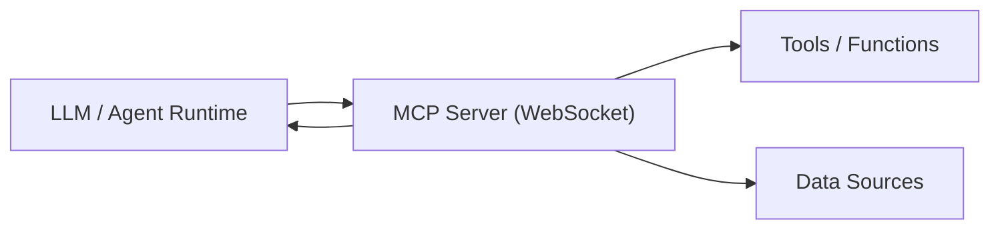
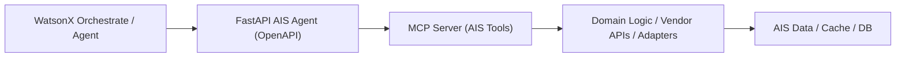
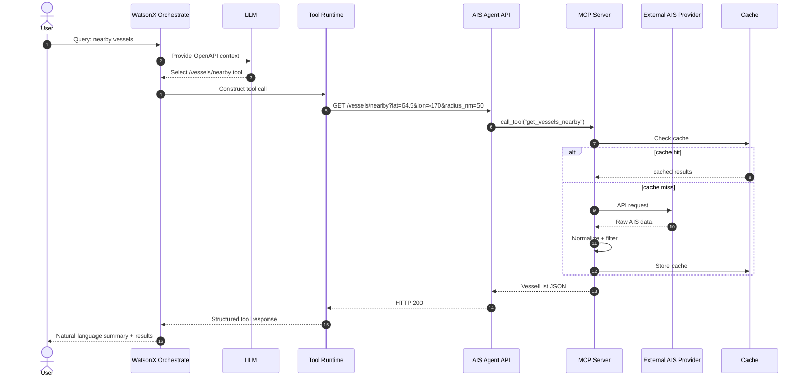
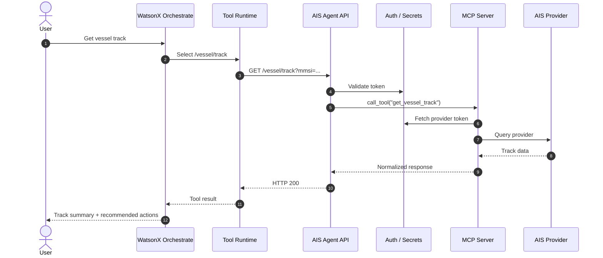
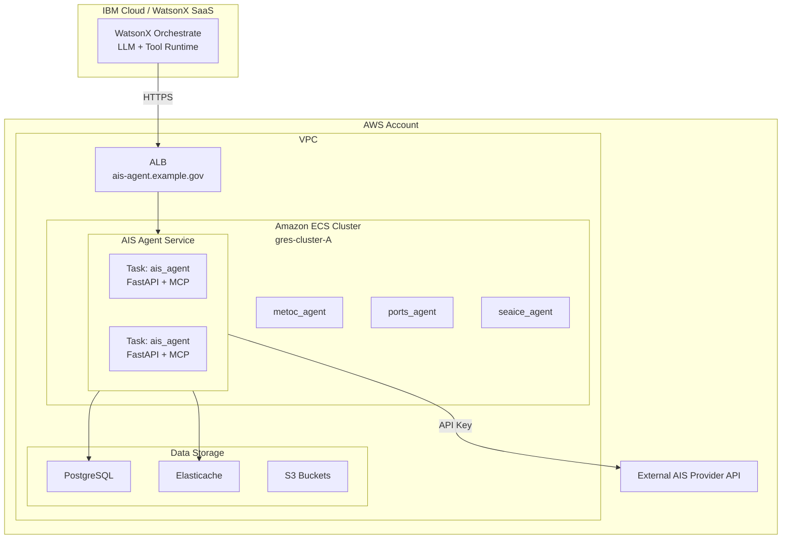
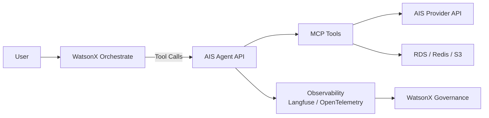

# AIS Agent Architecture

This document describes the architecture of the AIS (Automatic Identification System) Agent, including:

- How the **AIS Agent API** (FastAPI) relates to the **MCP server** and **WatsonX Orchestrate**
- The **OpenAPI contract** (`ais_openapi.yaml`) used for LLM tool-calls
- End-to-end request flows (including auth)
- Deployment on AWS ECS (`gres-cluster-A`)
- Data flow and governance / observability hooks

The goal is to keep **MCP tools**, **FastAPI implementation**, and **WatsonX Orchestrate tool usage** in sync via a single, curated contract.

---

## 1. Components Overview

### 1.1 AIS Agent API (FastAPI MCP Bridge)

- Implemented in `app.py`
- Exposes HTTP endpoints under `/mcp/ais/*` that conform to `ais_openapi.yaml`
- Delegates actual logic to the `ais_agent` module (`ais_agent.py`, `ais_vessel_info.py`, etc.)
- Serves the OpenAPI contract for orchestrators:

  - JSON: `/mcp/openapi.json`
  - YAML: `/mcp/openapi.yaml`
  - Docs: `/mcp/docs` (Swagger), `/mcp/redoc` (ReDoc)

The **server URL** in `ais_openapi.yaml` is:

```yaml
servers:
  - url: http://localhost:8200/mcp/ais
    description: MCP bridge to the local AIS agent (via mcp_server)
````

At runtime, Orchestrate sees paths like:

* `GET /vessels/nearby`
* `GET /vessels/aoi`
* `GET /vessel/info`
* `GET /vessel/photo`
* `GET /vessel/track`
* `GET /aoi`, `GET /aoi/{aoi_id}`
* `GET /vessel/events`
* `GET /vessel/portcalls`
* `GET /portcalls`
* `GET /routing/distance_to_port`
* `GET /routing/vessel_route_to_port`
* `GET /health`

…with the base URL `http://<host>/mcp/ais`.

---

### 1.2 MCP Server & AIS Logic

* `ais_agent.py` implements the **core AIS logic**, including:

  * Fetching vessel info by MMSI/IMO/name (`ais_vessel_info.py`)
  * Querying external AIS provider APIs
  * Normalizing & enriching AIS data
  * Tracing (e.g., Langfuse) via helper utilities (e.g., `trace_start`, `trace_end`)

* The MCP server exposes these capabilities as **tools** to higher-level agent runtimes (not just HTTP).

In this architecture:

* FastAPI is a **bridge** that:

  * Accepts HTTP requests shaped by `ais_openapi.yaml`
  * Calls MCP tools / logic in `ais_agent`
  * Returns normalized JSON responses

---

### 1.3 WatsonX Orchestrate & LLM Tool Use

WatsonX Orchestrate:

* Fetches the AIS Agent contract from `/mcp/openapi.json` or `/mcp/openapi.yaml`
* Registers each path as a **tool** the LLM can call
* Uses `tags`, `summaries`, `descriptions`, and **schemas** from `ais_openapi.yaml`
* Uses `x-llm-usage` metadata to improve tool selection

Example excerpt:

```yaml
x-llm-usage:
  guidance: |
    Use this API to answer questions about vessels, their positions, events, and port calls...
  canonical_examples:
    - user: "Show me nearby vessels around 64.5N, -170W within 50nm"
      tools:
        - name: GET /vessels/nearby
          params: { lat: 64.5, lon: -170, radius_nm: 50 }
```

This metadata makes the spec **LLM-tuned**, not just machine-readable.

---

## 2. API Contract (`ais_openapi.yaml`)

The AIS Agent API contract is defined in `ais_openapi.yaml`.

It defines:

* Endpoint structure & parameters
* Response schemas & examples
* LLM usage guidance metadata
* Sessions, tracing, and invocation patterns

Example header:

```yaml
openapi: 3.0.3
info:
  title: AIS Agent API
  version: 1.0.0
```

---

## 3. High-Level Architecture

### 3.1 Traditional REST Architecture



### 3.2 Pure MCP Server



### 3.3 Hybrid AIS Architecture (What We Run)



---

## 4. End-to-End Request Flows

### 4.1 Nearby Vessels (`GET /vessels/nearby`)



### 4.2 Vessel Track with Auth



---

## 5. Deployment on AWS ECS (`gres-cluster-A`)



---

## 6. Data Flow & Governance



---

## 7. Source of Truth & Workflow

| Artifact            | Role             | Maintained By                   |
| ------------------- | ---------------- | ------------------------------- |
| `ais_openapi.yaml`  | **API contract** | Edited manually (authoritative) |
| `app.py`            | FastAPI server   | Implementation follows contract |
| `ais_agent.py`      | MCP tool logic   | Implements tool calls           |
| `/mcp/openapi.yaml` | Served spec      | Mirrors contract file           |

### Recommended Workflow

1. Design & modify **`ais_openapi.yaml` first**
2. Generate/update FastAPI signatures to match
3. Implement MCP logic behind routes
4. Test with `curl` + Orchestrate tool calls
5. Monitor using Langfuse / Governance telemetry
6. Iterate spec based on usage

---

**End of Document**
